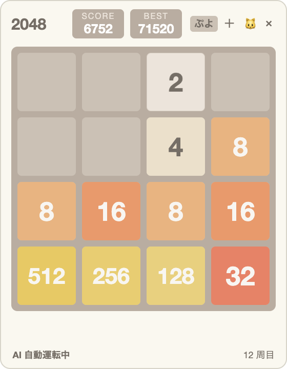
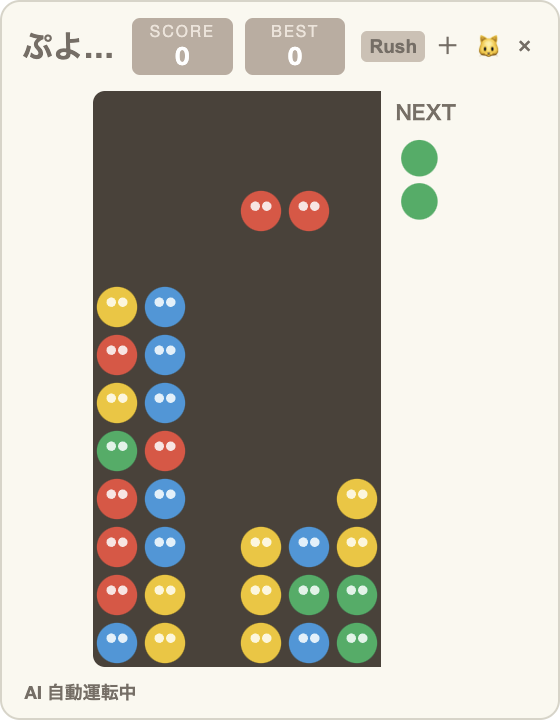
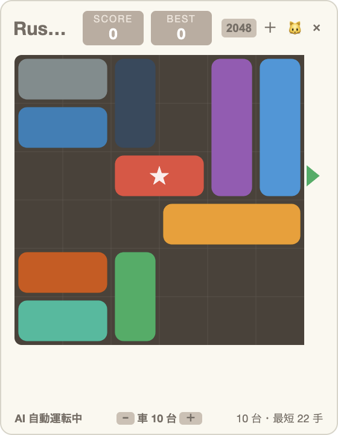
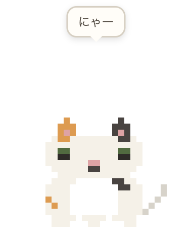
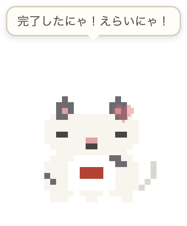

# DeskWidgets 🎮🐱

デスクトップの片隅で **AI が永遠にゲームを解き続ける**ウィジェットと、
**ドット絵の猫**が常駐するデスクトップアプリです。

| 2048 | ぷよぷよ | Rush Hour |
|:---:|:---:|:---:|
|  |  |  |

| デスクトップ猫 | リアクション |
|:---:|:---:|
|  |  |

## ダウンロード

[**Releases ページ**](../../releases/latest) から OS に合ったファイルをダウンロードしてください。

| OS | ファイル |
|---|---|
| macOS (Apple Silicon) | `DeskWidgets-x.x.x-arm64.dmg` |
| macOS (Intel) | `DeskWidgets-x.x.x.dmg` |
| Windows | `DeskWidgets-Setup-x.x.x.exe`（インストーラ）または `DeskWidgets-x.x.x-portable.exe`（インストール不要） |

> **macOS で「開発元を検証できません」と出る場合**（未署名のため）:
> アプリを右クリック →「開く」で起動できます。それでも開けない場合はターミナルで
> `xattr -cr /Applications/DeskWidgets.app` を実行してください。
>
> **Windows で SmartScreen の警告が出る場合**:「詳細情報」→「実行」で起動できます。

## 機能

### ゲームウィジェット（画面右下に常駐）

- **AI 自動運転**: 起動した瞬間から AI がプレイし続け、ゲームオーバーになっても自動リスタートで永遠に動き続けます
- **3 つのゲームをボタンで切替**
  - **2048** — Expectimax 探索。2048 を超えても無限に継続（4096/8192/16384/32768 専用色）
  - **ぷよぷよ** — なるべく死なない範囲で大連鎖を狙う AI（実測：3,000 手で死亡 0・最大 7 連鎖）
  - **Rush Hour** — BFS で最短手順を解き、クリアするたびに新しい問題を自動生成。
    車の台数（6〜12 台）をフッターの −/＋ で調整可能
- **手動モード**: ウィジェットをクリックしてフォーカスすると AI が止まり、矢印キーで操作できます。
  フォーカスを外すと AI が再開（Rush Hour は車をクリックで選択 → 矢印キー）
- **「＋」ボタン**でウィジェットを複数並べられます（右下から左へ整列）
- ウィンドウ端のドラッグでリサイズ（縦横比固定）、ヘッダーのドラッグで移動
- スコア・周回数・最大連鎖などは自動保存

### デスクトップ猫（🐱 ボタンで追加）

ドット絵の猫が透明ウィンドウでデスクトップを歩き回ります。

- **自律行動**: 待機・歩く・寝るを気分（普通/楽しい/眠い/好奇心/不機嫌）に応じて切替。放置すると寝ます
- **カーソル反応**: 近づくと耳を立てて目で追い、好奇心が高いと追いかけ、不機嫌だと逃げます
- **クリック**で喜んで吹き出し（「にゃー」）、**ダブルクリック**でメニュー（猫を変更/設定/寝かせる/もう 1 匹/さよなら）
- **6 種類の猫**: 三毛猫・黒猫・白猫・茶トラ・グレー猫・ビジネス猫（赤ネクタイ）
- **設定画面**: 名前・サイズ・カーソル追跡・最前面・自動起動・通知リアクションを設定、永続化
- **イベント連携**（将来の AI エージェント連携用）: タスク開始/完了・エラー・メッセージ受信・長時間放置に
  リアクション。設定画面のテストボタン、または `window.catEvent(type)` / `localStorage` の
  `cat.eventPing` キーで外部から発火できます

## 開発者向け

```bash
git clone https://github.com/nmatsumoto4/desk-widgets.git
cd desk-widgets
npm install
npm start        # 起動
npm run dist     # 配布用ビルド（dist/ に出力）
```

### ファイル構成

| ファイル | 役割 |
|---|---|
| `main.js` / `preload.js` | Electron メイン（ウィンドウ生成・整列・IPC） |
| `index.html` / `style.css` / `app.js` | ゲームウィジェット共通シェル（モード切替・手動/AI 切替） |
| `game.js` / `ai.js` / `mod2048.js` | 2048 ロジック / Expectimax AI / 描画 |
| `puyo.js` / `puyo-ai.js` / `mod-puyo.js` | ぷよぷよ ロジック / 連鎖 AI / 描画 |
| `rush.js` / `mod-rush.js` | Rush Hour ロジック・BFS ソルバー・問題生成 / 描画 |
| `cat.html` / `cat.css` / `cat.js` | デスクトップ猫（行動エンジン・メニュー） |
| `cat-types.js` / `cat-sprite.js` | 猫の種類（追加容易） / ドット絵スプライト |
| `cat-settings.*` | 猫の設定画面・イベントテスト |

新しいゲームは `show/hide/setAuto/key/relayout` の共通インターフェースに載せるだけ、
新しい猫は `cat-types.js` にパレットを 1 エントリ足すだけで追加できます。

## License

MIT
